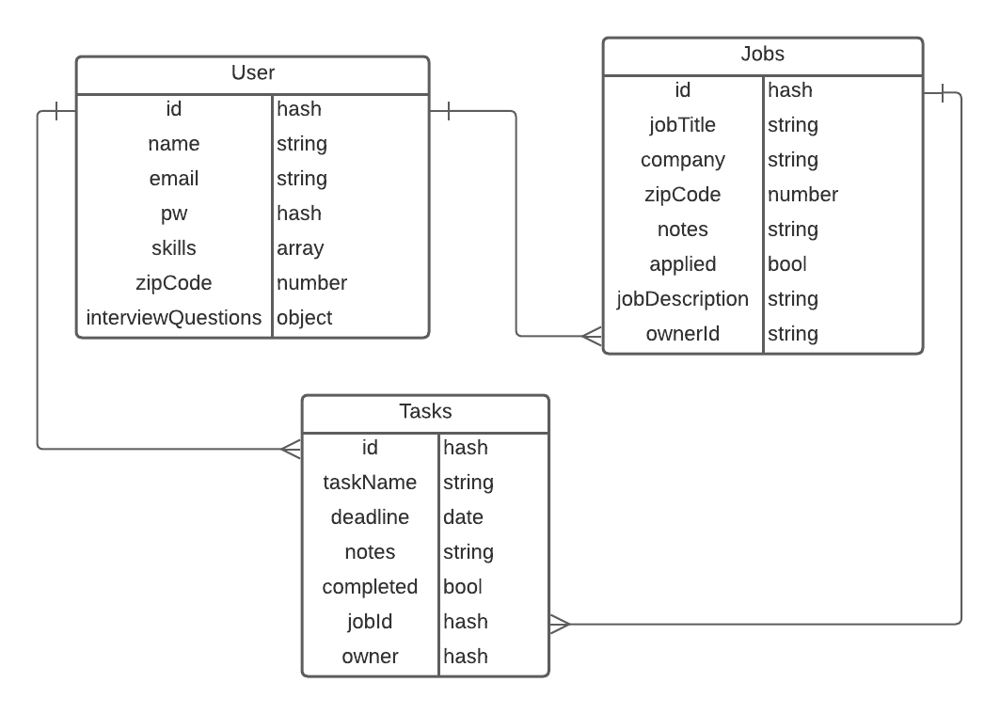

# MinMax Job Hunter
This repo is dedicated to the API that we built for MinMax Job Hunter. Learn even more about the app in its **[main repo here](https://github.com/devinrbopp/client-job-hunting-journal)**!

MinMax Job Hunter is an app designed to help recent tech grads organize their job search process. The app will have a page for the users profile, job listings, saved jobs, and details/task list. 

## Tech Stack
This app was created with the MERN stack. MERN stands for MongoDB, Express, React, and Node. 

- MongoDB is NoSQL database program. It is a non-relational database, meaning it does not use tables, allowing for a more agile and flexible manipulation of data. 

- Expres is a NodeJS framework that provides a myriad of methods and middleware to communicate with the database. 

- React is a framework/library used to create an interactive user interface. It updates and renders the pages as the data and code change. 

- Node is an asynchronus event-driven runtime environment. It allows us to run JavaScript on a server, tying the frontend and backend together. 

## ERD

In planning our database, we originally had Tasks stored as subdocuments of Jobs. We refactored this in order to make tasks more usable, particularly when displaying them outside of a job details page. 

## Obstacles
- Curly brackets
- Differentiating between needing a subdocument as opposed to a full document
- Ensuring that the proper data sets were deleted through our fetch requests

MinMax Job Hunter was built by Jerry Yang, Shuzel Lide, Hannah Legros, and Devin Bopp.